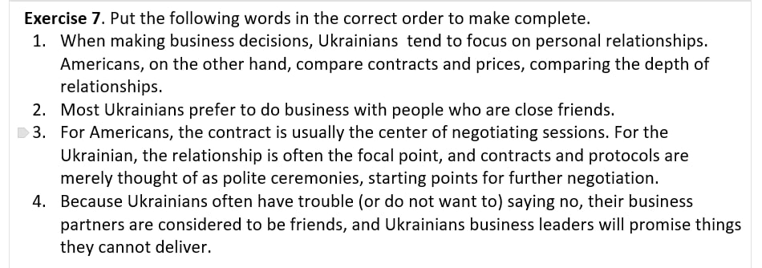
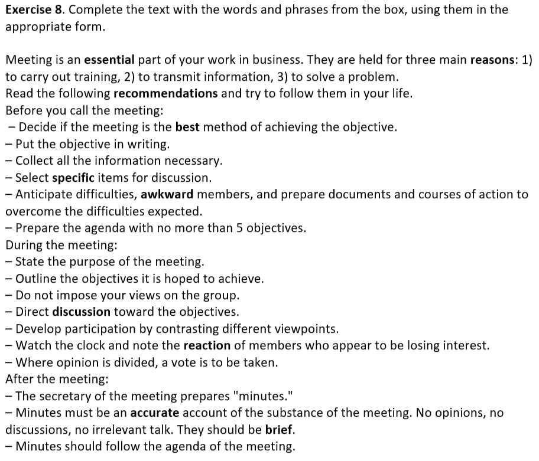
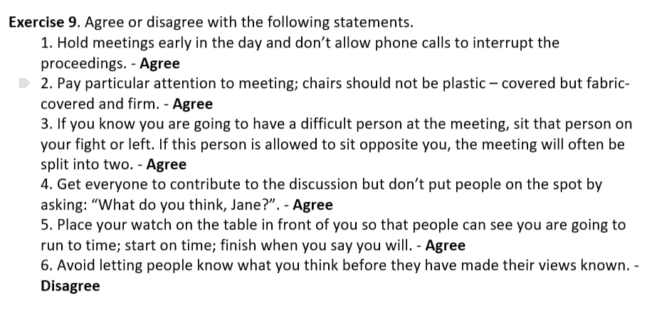

# Englsih

<h2>Tasks from photo</h2>
  <b>Which modern or historical leaders do you most admire? Which do you admire the least? Why?</b>

Idk

<b>What makes a great leader? Write down a list of characteristics.</b>
  <ul>
    <li>Critical thinking</li>
    <li>Strong communication skills</li>
    <li>Empathy</li>
    <li>Emotional intelligence</li>
    <li>Decisiveness</li>
    <li>Resilience and persistence</li>
  </ul>
<b>Are there differences between men and women as leaders? Why have most great leaders been men?</b>

Yes, there is differences in leadership between men and women. Women tend to be more collaborative and empathetic, while men are often perceived as more authoritative. Historically, most leaders have been men due to patriarchal structures that limited opportunities for women to rise to positions of power. However, this is changing as more women assume leadership roles today.

<b>Are people who were leaders at school more likely to be leaders later in life?</b>

It’s possible but not always guaranteed. Lidership qualities can be developed early in life, but someone who researched it later, can became leadership, worse or better.

